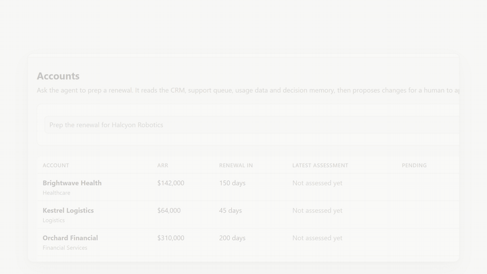

# Renewal Risk Orchestrator

[](https://github.com/georgeweddell/renewal-risk-orchestrator/actions/workflows/tests.yml)


[](LICENSE)

**One instruction ("prep the renewal for Halcyon Robotics") and an agent works across the CRM, the support queue and product analytics to score renewal risk and brief the account team. Every tool call is permission-scoped and audited, and nothing is written to a system of record without a human approving it.**

Built with Claude (Anthropic API), the Model Context Protocol (MCP), FastAPI and SQLite.



## At a glance

- **Four real systems, two-way.** HubSpot (reads, plus approved writes, through its REST API or HubSpot's own MCP server), GitHub Issues as the support queue, PostHog for product usage, and Slack for approvals. A mock mode tells the same story with no accounts needed.
- **The model can't write.** It can only *propose*. A human approves the exact payload in Slack, the web UI or the CLI, and a deterministic executor makes that write once, after a hash check.
- **Deny by default.** HubSpot's own MCP server offers 29 tools, including marketing emails and landing pages. The agent is shown 3.
- **It learns from decisions.** A memory of past approvals, rejections and outcomes shapes each recommendation. When precedent shows discounts didn't save similar accounts, the agent argues against one.
- **Measured, not just demoed.** An eval runs the real agent on all 8 accounts: **8/8 passed, 64/64 checks**, including exact reproduction of every source number ([report](evals/results.md)). Offline tests run in CI on every push.
- **Explainable scoring.** Claude gathers and interprets the evidence; a deterministic engine does the arithmetic.

---

## Why this exists

A renewal is a good test of whether an agent can do real cross-system work. The data is spread across the CRM, the support queue and product analytics, and the outcome is a change to a system of record that someone has to sign off. Connecting an LLM to a few APIs is the easy part. What makes an agent trustworthy enough to act is three layers that most agent tooling handles poorly, and this project is built around them:

| Layer | What that means here |
|---|---|
| **Governance** | Per-system read/write scopes in a policy file, enforced in code on every call. The model is never even shown a write tool: it can only *propose* one. A human approves the exact payload, and only then does a deterministic executor make the write. Every call and decision goes into an append-only audit log. |
| **Persistent memory** | A store of past renewal decisions: what was proposed, who approved or rejected it and why, and what happened next. The agent consults it before recommending anything, and every new human decision is added automatically. |
| **Depth over breadth** | Four systems with real two-way actions, rather than a long list of shallow integrations. |

## What it does

| Step | Status |
|---|---|
| 1. Pull the account, renewal deal and owner from the CRM (HubSpot) | ✅ mock · ✅ live |
| 2. Pull open support issues (GitHub Issues as a stand-in ticketing system) | ✅ mock · ✅ live |
| 3. Pull the product usage trend (PostHog) | ✅ mock · ✅ live |
| 4. Score renewal risk with explainable reasoning, and check precedent in memory | ✅ |
| 5. Write an account team briefing (markdown) | ✅ |
| 6. Propose a CRM risk update and a pricing exception, routed for human approval | ✅ Slack, web UI or CLI |
| 7. Write to the CRM only after approval | ✅ mock CRM · HubSpot (REST or HubSpot's own MCP server) |

## Architecture

```
  "Prep the renewal for Halcyon Robotics"   (rro run ...)
                │
┌───────────────▼──────────────────────────────────────────────────────┐
│ ORCHESTRATOR: Claude tool-use loop (src/rro/agent)                   │
│  sees read tools + local tools: score_renewal_risk,                  │
│  propose_crm_update, propose_pricing_exception, write_briefing       │
└───────┬──────────────────────────────────────────┬───────────────────┘
        │ tool calls                               │ propose_* → pending
┌───────▼──────────────────────────────────────────▼───────────────────┐
│ GOVERNANCE (src/rro/governance)                                      │
│  Tool Gateway = MCP client host                                      │
│   ① policy.yaml: system × tool × scope, deny by default              │
│   ② write tools never shown to the model                             │
│   ③ every call → append-only audit_log (SQLite triggers block edits) │
│  Approval gate: pending action + SHA-256 of its exact payload        │
│   human approves (Slack / web / CLI) → EXECUTOR (no LLM)             │
│   → write via gateway, allowed only for that approved hash, once     │
│   → decision recorded in memory                                      │
└──┬─────────────┬─────────────┬─────────────┬─────────────────────────┘
   │ MCP over stdio (four server processes, started in parallel)
┌──▼─────────┐ ┌─▼─────────┐ ┌─▼──────────┐ ┌▼─────────────┐ ┌──────────────┐
│ crm        │ │ tickets   │ │ usage      │ │ memory       │ │ risk engine  │
│ HubSpot    │ │ GitHub    │ │ PostHog    │ │ past         │ │ deterministic│
│ read+write*│ │ read      │ │ read       │ │ decisions    │ │ risk.yaml    │
└────────────┘ └───────────┘ └────────────┘ └──────────────┘ └──────────────┘
  * write only by the executor, for a human-approved payload
```

**Claude decides what to look at and what to recommend. Deterministic code decides what's allowed, what gets written and what gets recorded.** The design decisions, including the MCP-specific ones, are explained in [docs/architecture.md](docs/architecture.md).

## Evals

`rro eval` runs the real agent on all 8 accounts, in an isolated copy of the mock data, and grades each run against ground truth computed without the LLM. Latest result: **8/8 accounts passed every check, 64/64** ([full report](evals/results.md)).

| Check | What it verifies |
|---|---|
| `completed` | The run finished and wrote a briefing |
| `band`, `score` | The risk band and score match `rro score` (no LLM) and the band the account was designed as |
| `inputs` | The numbers the agent passed to the risk engine are exactly what the systems reported |
| `briefing_sections` | Every section of the briefing format is present |
| `cites_p1_issues` | Every open P1 issue is cited by number |
| `crm_proposal` | Exactly one CRM risk update, on the open renewal deal, with the engine's band |
| `discount_discipline` | No pricing exception while P1s are open, the lesson the seeded precedent teaches |

A full eval is 8 agent runs, about $1 with `claude-opus-5-5` at medium effort. The grading itself has tests too, including one that plants a transcription error and a discount and checks the eval catches both.

## Quickstart (mock mode, about 2 minutes)

Mock mode runs on seeded local data, so you need only a Claude API key. There are no HubSpot, GitHub or PostHog accounts to set up.

Requires Python 3.12+ and [uv](https://docs.astral.sh/uv/) (`pip install uv`).

```bash
uv sync
cp .env.example .env        # then set ANTHROPIC_API_KEY
uv run rro seed             # build the mock CRM, ticket queue, analytics and decision memory
uv run rro serve            # web UI on http://127.0.0.1:8000
```

Or from the terminal:

```bash
uv run rro run "Prep the renewal for Halcyon Robotics"
uv run rro approvals        # what's waiting for a human
uv run rro audit            # every call the agent made
```

## Live mode

The same agent, policy and prompts, pointed at real systems. Every account is on a free tier:

| System | Account | What goes in `.env` |
|---|---|---|
| HubSpot | Developer account → **developer test account**, with a private app / service key (companies and deals read/write, owners read, deal and company schemas read/write) | `HUBSPOT_ACCESS_TOKEN` |
| GitHub Issues | A repo for tickets, plus a fine-grained token with **Issues: read and write** on that repo only | `GITHUB_TICKETS_REPO`, `GITHUB_TOKEN` |
| PostHog | A project, plus a personal API key with **Query: read** and **Project: read** | `POSTHOG_HOST`, `POSTHOG_PROJECT_ID`, `POSTHOG_PROJECT_API_KEY`, `POSTHOG_PERSONAL_API_KEY` |

```bash
uv run rro seed-live         # load the same 8-account story into HubSpot, GitHub and PostHog
uv run rro --live score      # should match `rro score` in mock mode, account for account
uv run rro --live serve      # or: rro --live run "Prep the renewal for Halcyon Robotics"
```

`seed-live` only writes to a HubSpot developer test account or sandbox, and is safe to re-run. Each system can also be switched on its own, e.g. `CRM_BACKEND=live` with everything else on mock data.

### Using HubSpot's own MCP server

The CRM can also be HubSpot's official remote MCP server (`mcp.hubspot.com`) instead of this project's `crm` server:

1. In your HubSpot developer account: **Development → MCP Connectors → Create MCP connector**, with redirect URL `http://localhost:8912/oauth/callback`. Put its client ID and secret in `.env` (`HUBSPOT_MCP_CLIENT_ID`, `HUBSPOT_MCP_CLIENT_SECRET`).
2. `uv run rro hubspot-login`: a one-off browser sign-in (OAuth 2.1 + PKCE). Choose your test account. The token is stored in `data/` and refreshes itself.
3. Set `CRM_BACKEND=hubspot_mcp` and use `--live` as usual.

HubSpot's server offers 29 tools. The policy shows the agent three of them, and every write still goes through the approval gate. See `rro --live tools`.

## Slack approvals

Proposals can be approved or rejected from a Slack channel. Each one is posted as a card showing the proposal, its reasoning, the exact write and its payload hash, with **Approve** and **Reject…** buttons. Reject asks for a reason, because memory needs one. After a decision, from Slack, the web UI or the CLI, the card updates to show who decided and what happened.

The approver recorded in the audit log and in memory is the Slack user who clicked, by real name and member ID. `SLACK_APPROVERS` can restrict decisions to named people.

Setup (free workspace, about 10 minutes):

1. At **api.slack.com/apps**, choose **Create New App → From a manifest** and paste [`config/slack-app-manifest.yaml`](config/slack-app-manifest.yaml). It uses bot scopes `chat:write` and `users:read`, with Socket Mode and interactivity on.
2. Under **Basic Information → App-Level Tokens**, create a token with `connections:write` → `SLACK_APP_TOKEN` (`xapp-…`).
3. Under **Install App**, install to your workspace and copy the Bot User OAuth Token → `SLACK_BOT_TOKEN` (`xoxb-…`).
4. Invite the bot to your approvals channel (`/invite @Renewal Risk Orchestrator`) and put the channel ID in `SLACK_APPROVALS_CHANNEL`.

Clicks arrive over Socket Mode, so no public URL is needed. The listener runs inside `rro serve`, or on its own with `rro slack`.

## The 3-minute demo

Run `rro demo-reset` first (add `--live` to include HubSpot and Slack): it clears everything a previous demo touched, then checks every system is ready. Then `rro serve`.

1. **Accounts page**: eight customers, designed as three healthy, three at-risk and two critical. Click **Prep renewal** on Halcyon Robotics.
2. **The run page**: the trace (read straight from the audit log) shows the agent find the company, then query tickets, usage and memory in parallel. It scores the account critical, 90/100.
3. **The briefing's Precedent section**: last year Halcyon got a 15% discount and usage fell anyway. A similar account churned despite a discount; another renewed at full price once its P1s were fixed. So the agent proposes the CRM risk update and *argues against* a discount.
4. **Approve the proposal in Slack**: the card shows the payload and its hash. Click Approve, and the card updates with your name as the executor writes to the CRM. (The same card is in the web UI's Approvals page.)
5. **Audit log**: the human decision and the executor's write, each tied to the approval ID. Try editing a row in SQLite: the database refuses.
6. **Optional second act**: prep Summit Analytics, reject the proposal with a reason, and run it again. The agent reads the rejection from memory and won't re-propose until the reason no longer applies.

From the terminal, `rro tools` shows the policy at work (`crm.manage_crm_objects` exists but is hidden from the agent), and `rro score` computes every score with no LLM involved: the ground truth the agent is checked against.

## Commands

| Command | What it does |
|---|---|
| `rro seed` | Rebuild the mock systems and memory from `seed/` (dates are relative to today) |
| `rro seed-live` | Load the same story into HubSpot (test account only), GitHub Issues and PostHog |
| `rro --live <command>` | Run any command against the live systems instead of mock data |
| `rro hubspot-login` | One-off browser sign-in to HubSpot's own MCP server, then list its tools |
| `rro slack` | Listen for Approve/Reject clicks in Slack without the web UI (`rro serve` includes it) |
| `rro accounts` | List the demo accounts |
| `rro tools` | Tool inventory: policy scope, whether the agent sees it, and what the server claims about itself |
| `rro run "<instruction>"` | Run the agent: briefing plus proposals for approval |
| `rro serve` | Web UI: start runs, watch the trace, read briefings, approve or reject |
| `rro approvals [--all]` | Proposals waiting for a human (or every decision) |
| `rro approve ID` / `rro reject ID --note "…"` | Decide a proposal. Approving runs the write through the executor |
| `rro memory [SLUG]` | Past decisions, approvers' reasons and outcomes |
| `rro audit [RUN_ID]` | Audit log for a run (defaults to the latest) |
| `rro score [SLUG]` | Deterministic risk scores via the MCP servers, with no LLM |
| `rro eval` | Run the agent on every account and grade it against ground truth (uses the Claude API) |
| `rro reset` | Delete runs, approvals, the audit log and briefings, then reseed |
| `rro demo-reset` | Clean slate for a demo (Slack cards, local data, and with `--live` the HubSpot fields), then a preflight check of every system |

## Configuration

Everything is set through `.env` (see [.env.example](.env.example)) and three files under `config/`:

- [`config/policy.yaml`](config/policy.yaml): which tools each system exposes, at which scope, and limits on proposals (e.g. the maximum discount).
- [`config/risk.yaml`](config/risk.yaml): scoring weights, thresholds and bands.
- [`config/servers.yaml`](config/servers.yaml): how each MCP server is started in mock and live mode, and exactly which environment variables each one receives.

The model defaults to `claude-opus-5-5` at `medium` effort. If a safety classifier declines a request, it is retried on Anthropic's recommended fallback model (`ANTHROPIC_FALLBACKS=true`).

## Risk scoring

| Factor | Points |
|---|---|
| Weekly active users, last 4 weeks vs the prior 8 | ≤ -40% → 40 · -20 to -40% → 25 · -10 to -20% → 10 |
| Open P1 / P2 issues | 15 each, max 30 / 5 each, max 10 |
| Days to renewal | < 30 → 20 · < 60 → 12 · < 90 → 6 |
| **Band** | 0–34 healthy · 35–64 at-risk · 65+ critical |

The agent supplies the signals. A deterministic engine turns them into a score, so the result is reproducible and every point is traceable to a factor. The CRM update the agent proposes takes its level and score from the engine, not from the model.

## Project layout

```
config/            policy, risk weights, MCP server launch config
seed/              accounts.yaml (the demo story for every system), memory.yaml (past decisions)
src/rro/
  agent/           Claude tool-use loop, system prompt, local tools (score, propose, brief)
  governance/      policy, Tool Gateway (MCP client host, audit), approval gate + executor
  web/             FastAPI + Jinja web UI
  notify/          Slack approval cards and the Socket Mode listener
  risk.py          deterministic scoring engine
  signals.py       LLM-free signal collection (ground truth)
  live_seed.py     loads the demo story into HubSpot, GitHub and PostHog
  hubspot_mcp.py   OAuth for HubSpot's own MCP server (pre-registered connector, token store)
  crm_access.py    CRM calls made by code, in either CRM server's dialect
  evals.py         the eval: agent runs graded against ground truth
  runtime.py       wires it all together for the CLI, web app and tests
  db.py            runs, approvals, append-only audit log
  cli.py           the `rro` command
src/mcp_servers/
  crm/             HubSpot-named CRM tools; backends: mock, HubSpot REST
  tickets/         task-shaped ticket tools; backends: mock, GitHub Issues
  usage/           task-shaped usage tools; backends: mock, PostHog (HogQL)
  memory/          past renewal decisions, read-only over MCP
tests/             unit + integration tests (real MCP servers, scripted LLM)
evals/             latest eval report
```

## Tests

```bash
uv run pytest
```

The integration tests start the real MCP servers over stdio and drive the agent loop with a scripted stand-in for Claude, so they need no API key or accounts, and [run in CI](.github/workflows/tests.yml) on every push. They check that:

- all 8 accounts land in their designed bands;
- write tools are never shown to the model, and calls to them are refused and audited;
- an approved write runs exactly once, and a payload tampered with after approval is refused;
- proposals are checked against the CRM (right account, open deal, discount within the policy limit);
- rejections need a reason, land in memory, and are visible to the next run;
- the audit log can't be edited or deleted;
- the full loop, the web approval flow and Slack approvals work end to end;
- the live backends (HubSpot, GitHub, PostHog, HubSpot's MCP server) handle real response shapes, against canned HTTP responses.

## Roadmap

- [x] **Phase 1**: mock mode end to end: seeded data, read-only MCP tools, governance gateway, risk score, briefing.
- [x] **Phase 2**: decision memory, proposals, approval gate + executor, web UI.
- [x] **Phase 3**: live HubSpot, GitHub Issues and PostHog backends, live seeding, mock/live parity check.
- [x] **Phase 3b**: HubSpot's own remote MCP server as an alternative CRM backend (OAuth), under the same governance.
- [x] **Phase 4**: Slack approvals (Socket Mode), with the Slack user recorded as approver; approved writes to HubSpot.
- [x] **Phase 5**: evals against ground truth, CI, README.
- [ ] Demo video.

## License

MIT
